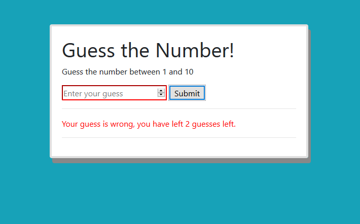

# Number-guessing-game

The user guesses a number that has been randomly generated by the computer between 1-10.
There is 3 attepmts to guess the right number.
If no more attempts left - the user is lost and is being offered to play again, although after each mistake is being informed how many attempts are left.

The game is written using pure vanilla **JavaScript** and **Bootstrap** classes for display.